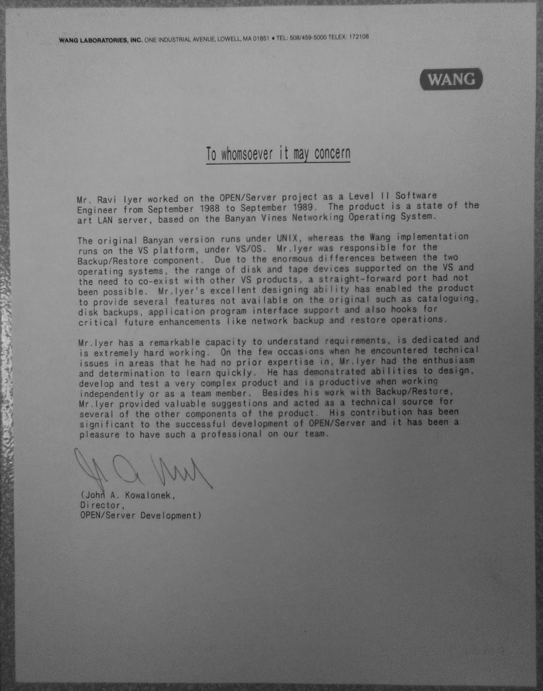
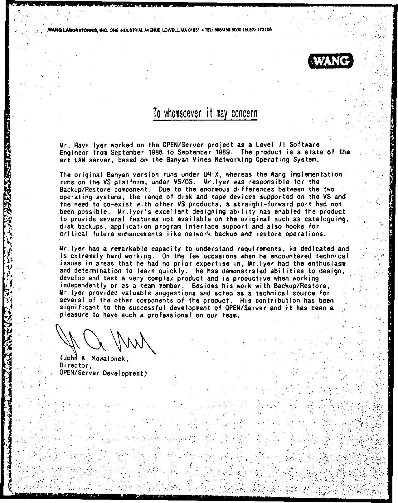
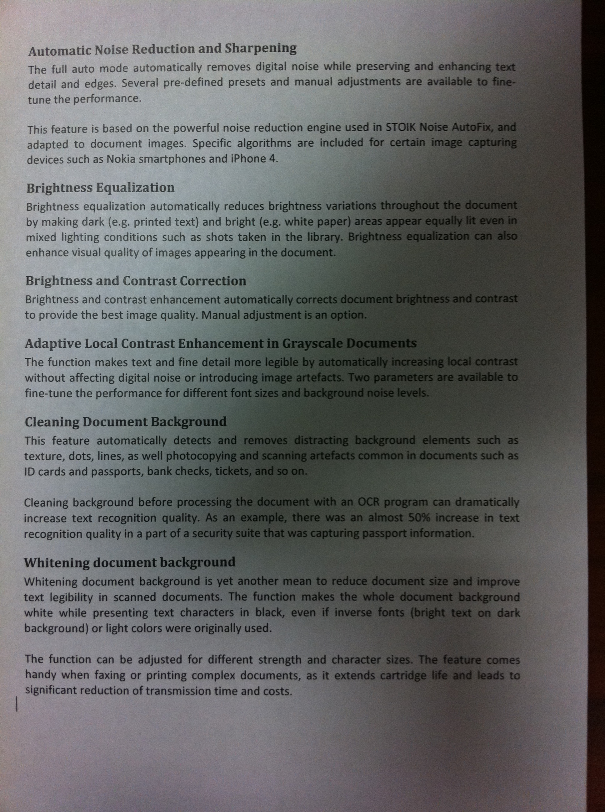
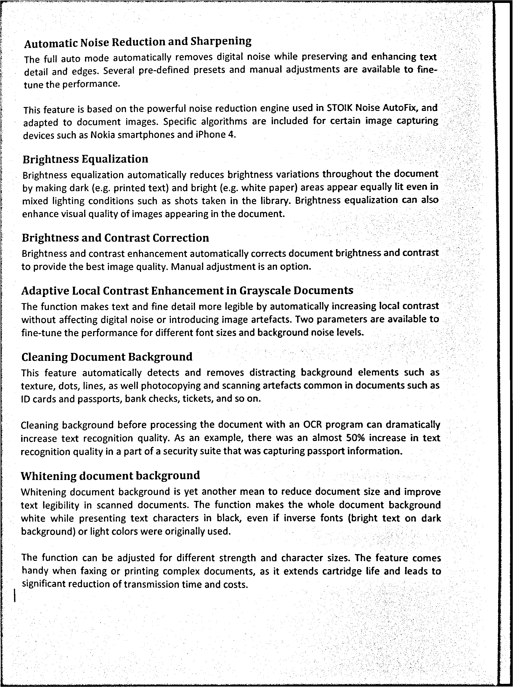

# PrinterMagick

A simple Windows batch script that uses [ImageMagick](https://imagemagick.org/) to clean up document photos and scans, then combine them into a PDF.

## Quick Start

1. **Download** [PrinterMagick.bat](https://github.com/skelebro1/printermagick/raw/refs/heads/main/PrinterMagick.bat)

2. **Install** [ImageMagick](https://github.com/ImageMagick/ImageMagick) from the official GitHub repository.

Verify the installation by opening Command Prompt and running:

```bat
magick -version
```

3. **Place** all your `.jpg` or `.jpeg` images in the _same directory_ as `PrinterMagick.bat`.

```text
Directory/
├── PrinterMagick.bat
├── image1.jpg
├── image2.jpg
└── image3.jpg
```

4. **Run** the script by double-clicking `PrinterMagick.bat`

An output folder will be created in the **same directory** as `PrinterMagick.bat` and the processed images along with the PDF will be placed there:

```text
Directory/
├── PrinterMagick.bat
├── page01.jpg
├── page02.jpg
├── page03.jpg
└── output/
    ├── page01.jpg
    ├── page02.jpg
    ├── page03.jpg
    └── scans.pdf
```

Your original images are left untouched.

## Before and After

| Original                                                              | Processed                                                                |
| --------------------------------------------------------------------- | ------------------------------------------------------------------------ |
| [](./examples/original-1.jpg) | [](./examples/output/processed-1.jpg) |
| [](./examples/original-2.jpg) | [](./examples/output/processed-2.jpg) |

## What It Does

* Corrects image orientation
* Converts images to grayscale
* Straightens crooked pages
* Removes uneven backgrounds and shadows
* Improves contrast
* Reduces noise and speckles
* Combines the processed images into a PDF

## Requirements

* Windows
* [ImageMagick](https://imagemagick.org/)

Check that ImageMagick is installed:

```bat
magick -version
```

## Output

Processed images are saved to the `output` folder, along with:

```text
output/scans.pdf
```

The PDF is image-based and does not include OCR or searchable text.

## License

MIT License
